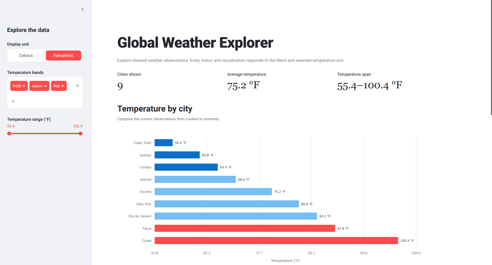

# ctd-capstone-weather

Code the Dream Capstone scraping project using Selenium to collect global weather observations. 


## Submission screenshot




# Summary

This project uses Selenium via a headless chromium browser to go to a weather website, scrape information relating to tempertures across different cities then dispalys that information with a streamlit dashboard.

## Dashboard visualizations

The dashboard contains three complementary views:

1. Temperature by city
2. Temperature band distribution:
3. Temperature spread by band

## Scraping

All scraping tasks use Selenium and a headless chromium browser.


# Installation Requirements 
You will need either Chrome or Chromiumto run the Selenium scraper. 
You will also need Ubuntu/Debian/Linux or MacOS/Windows and at least 8GB of Ram to run the scraping engine.

## Setup
1. Create a Python Virtual Environment

On Ubuntu/Linux, install the required packages:
```
sudo apt update
sudo apt install python3 python3-venv python3-pip -y
```
2. Create a virtual environment:
   

```python3 -m venv .venv
```
3. Activate the python virtual enviroment

```
source .venv/bin/activate
```
You should now see (.venv) in your terminal prompt.


4. Install the required packages to run the program
```
pip install -r requirements.txt
```


## Run the scraper

```
python weather_scraper.py
```

## Start the streamlit dashboard and the web server

```
streamlit run streamlit_app.py
```


 ```

# License 
GPL3 